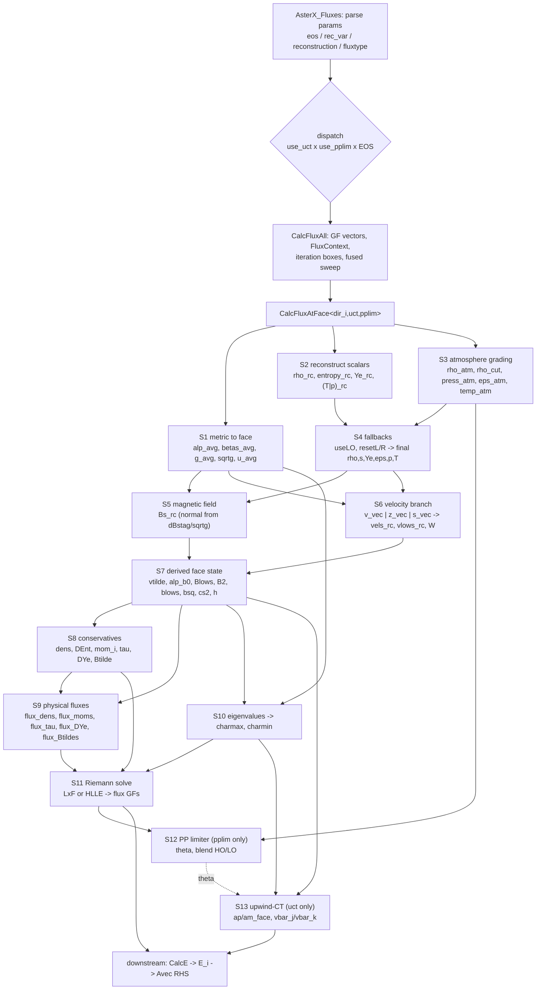

# Flux construction in `AsterX/src/fluxes.cxx` — reconstruction to Riemann solve

Reference document for the GRMHD numerical-flux pipeline: what is computed, in
what order, and what each quantity depends on. Everything below is read off the
source as it stands on `opt/flux-launch-bounds`; equation numbers here are local
to this document.

Companion files:

- `AsterX/src/fluxes.hxx` — the bare LxF / HLLE solvers.
- `AsterX/src/eigenvalues.hxx` — characteristic speeds.
- `ReconX/src/reconstruct.hxx` (+ `minmod/monocentral/ppm/eppm/wenoz/wenozp/mp5.hxx`) — reconstruction operators.
- `AsterUtils/src/aster_utils.hxx`, `aster_interp.hxx` — contractions, cross products, vertex→face averages, upwind averages.
- `AsterX/src/lo_flag.cxx` — the `LOflag` shock detector consumed in §4.

## 0. Notation and conventions

| Symbol | Meaning |
| --- | --- |
| `dir_i` | flux direction (template parameter, 0/1/2) |
| `dir_j`, `dir_k` | the cyclic completion: `(dir_i+1)%3`, `(dir_i+2)%3` |
| `p.I` | index of the **lower** face of cell `p.I` in direction `dir_i` |
| `Im = p.I - p.DI[dir_i]` | cell to the **left/minus** of the face |
| `Ip = p.I` | cell to the **right/plus** of the face |
| slot `(0)` | left state, reconstructed from the `Im` side |
| slot `(1)` | right state, reconstructed from the `Ip` side |
| `_rc` suffix | reconstructed face state (the physical pipeline) |
| `_ppl` suffix | the parallel, cell-centred state rebuilt for the PP limiter (§12) |
| $f$ | free side index, $f\in\{0,1\}$; every `vec<CCTK_REAL,2>` below carries it |

Indices $i,j,k$ run over the three spatial directions; $g_{ij}$, $\alpha$,
$\beta^i$ are the ADM 3-metric, lapse and shift; $W$ is the Lorentz factor;
$\sqrt{g}=\sqrt{\det g_{ij}}$. All conserved variables carry the $\sqrt{g}$
densitization.

## 1. Dependency overview



Reading the graph: **S1–S3 are independent of one another**; S4 is the join of
S2 and S3; S5/S6 need S1 (metric) and S4 (the LO decision); S7 is the pure
algebraic closure; S8/S9 are pure functions of S7; S10 needs S7 plus `u_avg`
from S1; S11 is the only place where left and right states are combined. S12 and
S13 are compile-time-optional epilogues.

## 2. Kernel structure and dispatch

`AsterX_Fluxes` (line 1568) translates the string parameters into enums
(`eos_3param`, `rec_var_t`, `reconstruction_t` for both the primary and the LO
method, `flux_t`), fills `reconstruct_params_t`, and then dispatches the two
runtime booleans `use_uct` and `use_pplim` onto **compile-time** template
parameters:

```
run_all(uct, pplim) -> CalcFluxAll<uct, pplim, EOSType>(...)
```

so each configuration compiles only its own half of the per-face work
(4 flag combinations × EOS instantiations). `use_uct=yes` compiles out the
flux-CT induction fluxes; `use_pplim=no` compiles out the entire limiter block
including its duplicated state reconstruction.

`CalcFluxAll` (line 1305):

1. Asserts the ghost-zone requirement of the reconstruction stencil —
   1 for `Godunov`, 2 for `minmod`/`monocentral`, 3 for
   `ppm`/`eppm`/`wenoz`/`wenozp`/`mp5`.
2. Packs every grid function, parameter and flesh scalar into one
   `FluxContext<EOSType>` (line 44), captured by value by the device lambda.
3. Computes, per direction, the zero-init box (`box_all` at that face
   centering) and the flux box (`calc_mixpn_box`: all points transverse,
   interior ± `nloop` normal, with `nloop = (hydro_correction_order-2)/2`).
4. Runs **one fused sweep** `loop_box_device<0,0,0>` over the union of all six
   boxes. Per point: zero every direction whose init box contains it, then call
   `CalcFluxAtFace<0/1/2, uct, pplim>` for every direction whose flux box
   contains it. The face coordinate is not taken from `p.X` (the loop is
   cell-centred) but recomputed per direction as

   $$X^{(\mathrm{face})} = x_0 + \bigl(\mathrm{lbnd} + I - \tfrac{1}{2}\,\overline{\mathrm{facetype}}\bigr)\,\Delta x$$

   which reproduces bit-for-bit the `p.X` the pre-fusion face-centred loops
   supplied.

Everything from §3 on happens inside `CalcFluxAtFace` (line 138), once per face
per direction.

## 3. S1 — Metric interpolation to the face

Vertex-centred geometry is averaged onto the face with the 4-point average
`calc_avg_v2f<dir_i>` (`aster_interp.hxx:131`), i.e. over the four vertices of
the face:

$$
\langle q\rangle_{\mathrm{face}} = \tfrac{1}{4}\sum_{d_j=0}^{1}\sum_{d_k=0}^{1} q\bigl(I + d_j\,\mathrm{DI}[j] + d_k\,\mathrm{DI}[k]\bigr) \tag{3.1}
$$
applied to $\alpha$, $\beta^i$ and $g_{ij}$, giving `alp_avg`, `betas_avg(i)`,
`g_avg(i,j)`. From these:

$$\det g = \det(g_{ij})_{\mathrm{face}},\qquad \sqrt{g} = \sqrt{\det g},\qquad u \equiv (g^{-1})^{\,\mathrm{dir}_i\,\mathrm{dir}_i} \tag{3.2}$$

`u_avg` (line 764) is the only inverse-metric component needed, and only by the
eigenvalue solve (S10). `beta_avg = betas_avg(dir_i)` is the normal shift
component.

## 4. S2 — Reconstruction operator

Both reconstruction lambdas call the single ReconX entry point

```
reconstruct<vec<CCTK_REAL,2>>(var, p, method, dir_i, gf_is_rho, gf_is_press,
                              press, gf_vel_dir_i, reconstruct_params)
```

with `reconstruct_pt` using `reconstruction` and `reconstruct_loworder` using
`reconstruction_LO`. The return is the pair $\bigl(q^{L},q^{R}\bigr)$ of face
values seen from `Im` and from `Ip`.

The stencil is $\{I_{---},I_{--},I_-,I_+,I_{++},I_{+++}\}$ =
$\{I-3\mathrm{DI},\dots,I+2\mathrm{DI}\}$ with $I_-=Im$, $I_+=Ip$.

**Godunov** (first order, no limiting):

$$q^{L} = q_{Im},\qquad q^{R} = q_{Ip} \tag{4.1}$$

**minmod** (slope-limited, 2nd order):

$$q^{L} = q_{Im} + \tfrac12\,\mathrm{mm}(q_{Ip}-q_{Im},\; q_{Im}-q_{Imm}),\qquad
q^{R} = q_{Ip} - \tfrac12\,\mathrm{mm}(q_{Ipp}-q_{Ip},\; q_{Ip}-q_{Im}) \tag{4.2}$$

with $\mathrm{mm}(x,y)=0$ if $\mathrm{sgn}\,x\neq\mathrm{sgn}\,y$, else the
argument of smaller modulus.

**monocentral** — same shape as (4.2) with the MC limiter

$$\mathrm{mc}(x,y) = \mathrm{sgn}(x)\,\min\!\Bigl(2|x|,\,2|y|,\,\tfrac{|x+y|}{2}\Bigr)\quad(\text{0 on sign change}) \tag{4.3}$$

**ppm / eppm / wenoz / wenozp / mp5** — 5th-order-class operators over the
6-point stencil. They all share the same idiom: the one-sided operator is
evaluated twice, once on the stencil centred at `Im` and once on the stencil
centred at `Ip`, and the face pair is assembled as

$$\bigl(q^{L},q^{R}\bigr) = \bigl(\mathrm{rc}_{Im}[+],\; \mathrm{rc}_{Ip}[-]\bigr) \tag{4.4}$$

(see e.g. `wenoz_reconstruct`, `ReconX/src/wenoz.hxx:106`, and the `eppm` case
in `reconstruct.hxx`). PPM/ePPM additionally consume `press` and the
normal-direction velocity `gf_vel_dir_i` for shock detection and zone
flattening, which is why the `gf_is_rho` / `gf_is_press` flags and those two
grid functions are threaded through every call; WENO-Z/WENO-Z+/MP5 use only the
variable itself plus `weno_eps`/`weno_mp`/`mp5_alpha`.

**Always reconstructed first**: `rho_rc`, `entropy_rc`, `Ye_rc`. Then either
`temp_rc` or `press_rc`, depending on `reconstruct_with_temperature`.

## 5. S3 — Graded atmosphere at the two cell centres

Independent of the reconstruction; needed both by the fallback logic (S4) and by
the PP limiter floors (S12). The two neighbouring **cell-centre** radii are
built from the face coordinate:

$$r_{(0)}^2 = \sum_{m}\Bigl(X^{(\mathrm{face})}_m - \tfrac{\delta_{m,\mathrm{dir}_i}}{2}\Delta x_{\mathrm{dir}_i}\Bigr)^2,\qquad
r_{(1)}^2 = \sum_{m}\Bigl(X^{(\mathrm{face})}_m + \tfrac{\delta_{m,\mathrm{dir}_i}}{2}\Delta x_{\mathrm{dir}_i}\Bigr)^2 \tag{5.1}$$

Density grading, with the EOS range as a hard floor:

$$\rho_{\rm atm}(f) = \max\Bigl[\rho_{\min}^{\rm EOS},\;
\begin{cases}\rho_{\rm abs\,min}\,(r_{\rm atmo}/r_{(f)})^{n_\rho} & r_{(f)}>r_{\rm atmo}\\ \rho_{\rm abs\,min} & \text{else}\end{cases}\Bigr],
\qquad \rho_{\rm cut}(f) = \rho_{\rm atm}(f)\,\texttt{recon\_thresh} \tag{5.2}$$

Thermodynamic grading, two mutually exclusive branches:

- `use_press_atmo = yes`:
  $p_{\rm atm} = \max\bigl[p(\rho_{\rm atm},T^{\rm EOS}_{\min},Y_{\rm atmo}),\;
  p_{\rm atmo}(r_{\rm atmo}/r)^{n_p}\bigr]$, then
  $\varepsilon_{\rm atm} = \varepsilon(\rho_{\rm atm},p_{\rm atm},Y_{\rm atmo})$,
  $T_{\rm atm} = T(\rho_{\rm atm},\varepsilon_{\rm atm},Y_{\rm atmo})$.
- `use_press_atmo = no`:
  $T_{\rm atm} = \max\bigl[T^{\rm EOS}_{\min},\,t_{\rm atmo}(r_{\rm atmo}/r)^{n_T}\bigr]$,
  then $p_{\rm atm} = p(\rho_{\rm atm},T_{\rm atm},Y_{\rm atmo})$ and
  $\varepsilon_{\rm atm} = \varepsilon(\rho_{\rm atm},T_{\rm atm},Y_{\rm atmo})$.

## 6. S4 — Fallback cascade: `useLO`, `resetL/R`, EOS closure

Three nested safety layers, in this order.

**(a) Shock flag.** `useLO = true` if either adjacent cell is flagged:

$$\texttt{useLO} \;\mathrel{|}=\; \texttt{LOflag}(I_p) \;\lor\; \texttt{LOflag}(I_m) \tag{6.1}$$

**(b) Positivity of the reconstructed scalars.** With
$X\in\{T,p\}$ selected by `reconstruct_with_temperature`, if for **either** side

$$\rho_{\rm rc}(f)\le\rho_{\rm cut}(f)\;\lor\; s_{\rm rc}(f)\le 0 \;\lor\; Y_{\rm rc}(f)\le 0 \;\lor\; X_{\rm rc}(f)\le 0 \;\lor\;\texttt{useLO} \tag{6.2}$$

then `useLO = true` and **all four scalars are re-reconstructed** with
`reconstruction_LO` (`Godunov`/`minmod`/`monocentral`/`ppm`). Note the
consequence for the graph: this single boolean also switches S5 (transverse
$B$) and S6 (velocity) to the LO operator, and selects the LxF flux in S11 when
`loworder_flux` is set.

**(c) Atmosphere reset.** Per side independently, if still
$\rho_{\rm rc}(f)\le\rho_{\rm cut}(f)$, set `resetL`/`resetR` and overwrite

$$\rho_{\rm rc}=\rho_{\rm atm},\quad s_{\rm rc}=\kappa(\rho_{\rm atm},\varepsilon_{\rm atm},Y_{\rm atmo}),\quad X_{\rm rc}=X_{\rm atm},\quad Y_{\rm rc}=Y_{\rm atmo} \tag{6.3}$$

and later (line 620, after S6) also $W=1$, $v^i=v_i=0$ on that side.

**(d) EOS closure**, per side:

$$\text{T-branch:}\quad \varepsilon_{\rm rc}=\varepsilon(\rho,T,Y),\quad p_{\rm rc}=p(\rho,T,Y)$$
$$\text{p-branch:}\quad \varepsilon_{\rm rc}=\varepsilon(\rho,p,Y),\quad T_{\rm rc}=T(\rho,\varepsilon,Y) \tag{6.4}$$

so that after this point **all of** $\rho,\varepsilon,p,T,Y,s$ exist on both
sides regardless of branch. Finally

$$(\rho h)_{\rm rc} = \rho + \rho\varepsilon + p \tag{6.5}$$

(used only by the `s_vec` branch of S6).

## 7. S5 — Magnetic field at the face

The **normal** component is single-valued: it is read from the staggered,
divergence-constrained $\tilde B$ and therefore identical on both sides:

$$B^{\mathrm{dir}_i}(0) = B^{\mathrm{dir}_i}(1) = \frac{\texttt{dBstag}_{\mathrm{dir}_i}(I)}{\sqrt{g}} \tag{7.1}$$

The two **transverse** components are reconstructed like any scalar (LO if
`useLO`):

$$B^{\mathrm{dir}_j},\,B^{\mathrm{dir}_k} \;\leftarrow\; \mathrm{reconstruct}(\texttt{Bvec}_{\mathrm{dir}_j/\mathrm{dir}_k}) \tag{7.2}$$

This is what makes the diagonal induction flux vanish identically (§10) and is
the reason `fluxB_j`/`fluxB_k` exist but no `fluxB_i`.

## 8. S6 — Velocity: three reconstruction variables

Selected by `recon_type` (`rec_var_t`). All three end at the same triple
$(v^i, v_i, W)$.

**`v_vec`** — reconstruct $v^i$ directly, with a two-stage limiter:

$$v_i = g_{ij}v^j,\qquad v^2 = v^i v_i,\qquad W = \frac{1}{\sqrt{1-v^2}} \tag{8.1}$$

If $v^2\ge v_{\rm lim}^2$ on either side and we are not already LO, the three
components are re-reconstructed with the LO operator and $v_i$, $v^2$ recomputed.
If $v^2$ is *still* over the limit, that side is rescaled:

$$v^i \to \frac{v_{\rm lim}}{\sqrt{v^2}}\,v^i,\qquad v_i \to \frac{v_{\rm lim}}{\sqrt{v^2}}\,v_i,\qquad v^2 \to v_{\rm lim}^2 \tag{8.2}$$

with the limit taken from the Con2Prim parameter `vw_lim`:

$$W_{\rm lim} = \sqrt{1+v w_{\rm lim}^2},\qquad v_{\rm lim} = \frac{v w_{\rm lim}}{W_{\rm lim}} \tag{8.3}$$

**`z_vec`** — reconstruct $z^i = W v^i$ (no limiter needed, $W$ is
automatically real):

$$z_i = g_{ij}z^j,\quad z^2 = z^i z_i,\quad W = \sqrt{1+z^2},\quad v^i = \frac{z^i}{W},\quad v_i = \frac{z_i}{W} \tag{8.4}$$

**`s_vec`** — reconstruct $s^i$ (the specific momentum $\rho h W^2 v^i$):

$$s^2 = s^i s_i,\qquad W = \sqrt{\tfrac12 + \sqrt{\tfrac14 + \frac{s^2}{(\rho h)^2}}},\qquad v^i = \frac{s^i}{W^2\,\rho h},\quad v_i = \frac{s_i}{W^2\,\rho h} \tag{8.5}$$

which is the positive root of $s^2 = (\rho h)^2 W^4 v^2 = (\rho h)^2 W^2(W^2-1)$.
This is the only branch that depends on (6.5), i.e. on the EOS closure.

Then the atmosphere reset of §6(c) zeroes the velocity on any reset side.
This closes the block marked `/* END RECONSTRUCTION */` (line 634).

## 9. S7 — Derived face state (both sides)

Pure algebra on $(\rho,\varepsilon,p,T,Y,s,B^i,v^i,v_i,W)$ and the face metric:

$$\tilde v^i = \alpha v^i - \beta^i \tag{9.1}$$

$$\alpha b^0 = W\,B^i v_i \tag{9.2}$$

$$B_i = g_{ij}B^j,\qquad B^2 = B^i B_i \tag{9.3}$$

$$b_i = \frac{B_i}{W} + \alpha b^0\, v_i \tag{9.4}$$

$$b^2 = b^\mu b_\mu = \frac{B^2 + (\alpha b^0)^2}{W^2} \tag{9.5}$$

$$c_s^2 = \bigl[c_s(\rho,T,Y)\bigr]^2,\qquad h = 1 + \varepsilon + \frac{p}{\rho} \tag{9.6}$$

The direction-specific scalars extracted for later use are
$\beta \equiv \beta^{\mathrm{dir}_i}$, $v\equiv v^{\mathrm{dir}_i}$,
$B\equiv B^{\mathrm{dir}_i}$, $\tilde v\equiv \tilde v^{\mathrm{dir}_i}$.

## 10. S8/S9 — Conserved variables and their physical fluxes

### Conservatives (per side)

$$\texttt{dens} = \sqrt{g}\,D = \sqrt{g}\,\rho W \tag{10.1}$$

$$\texttt{DEnt} = \sqrt{g}\,\rho W s \tag{10.2}$$

$$\texttt{DYe} = \texttt{dens}\cdot Y_e \tag{10.3}$$

Two auxiliaries carry the magnetic enthalpy:

$$\texttt{dens\_h\_W} = \texttt{dens}\cdot h\cdot W = \sqrt{g}\,\rho h W^2 \tag{10.4}$$

$$Q \equiv \texttt{dens\_h\_W} + \sqrt{g}\bigl[(\alpha b^0)^2 + B^2\bigr] = \sqrt{g}\,(\rho h + b^2)W^2 \tag{10.5}$$

(the identity uses (9.5)), and the total pressure

$$p_{\rm tot} = p + \tfrac12 b^2 \tag{10.6}$$

so that

$$\texttt{mom}_i = \sqrt{g}\,S_i = Q\,v_i - \sqrt{g}\,\alpha b^0\, b_i \tag{10.7}$$

$$\texttt{tau} = \sqrt{g}\,\tau = \texttt{dens\_h\_W} - \texttt{dens} + \sqrt{g}\bigl(B^2 - p_{\rm tot}\bigr)
\;\equiv\; \sqrt{g}\Bigl[(\rho h + b^2)W^2 - p_{\rm tot} - (\alpha b^0)^2 - D\Bigr] \tag{10.8}$$

$$\tilde B^i = \sqrt{g}\,B^i \qquad \text{(flux-CT only, see below)} \tag{10.9}$$

### Physical fluxes in direction `dir_i` (per side)

With $\alpha\sqrt g$ and $B/W$ as shared auxiliaries:

$$F(\texttt{dens}) = \texttt{dens}\;\tilde v \tag{10.10}$$

$$F(\texttt{DEnt}) = \texttt{DEnt}\;\tilde v,\qquad F(\texttt{DYe}) = \texttt{DYe}\;\tilde v \tag{10.11}$$

$$F(\texttt{mom}_j) = \texttt{mom}_j\,\tilde v + \alpha\sqrt{g}\Bigl(p_{\rm tot}\,\delta^{\mathrm{dir}_i}_{\;j} - b_j\,\frac{B}{W}\Bigr) \tag{10.12}$$

$$F(\texttt{tau}) = \texttt{tau}\,\tilde v + \alpha\sqrt{g}\Bigl(p_{\rm tot}\,v - \alpha b^0\,\frac{B}{W}\Bigr) \tag{10.13}$$

### Induction fluxes — flux-CT only (`if constexpr (!uct)`, line 798)

$\tilde B^i$, $E_i$ and $F(\tilde B)$ are computed **inside** the compile-time
guard, so the upwind-CT instantiation never carries them in its live set:

$$E_i = \tilde\epsilon_{ijk}\,\tilde B^j\,\tilde v^k \tag{10.14}$$

$$F(\tilde B)_m = \bigl(\hat e_{\mathrm{dir}_i}\times E\bigr)_m
\;\Longrightarrow\;
F(\tilde B^{\mathrm{dir}_i}) = 0,\quad
F(\tilde B^{\mathrm{dir}_j}) = -E_{\mathrm{dir}_k},\quad
F(\tilde B^{\mathrm{dir}_k}) = +E_{\mathrm{dir}_j} \tag{10.15}$$

The vanishing diagonal component is exactly why only two induction-flux grid
functions per direction exist (`fluxB_j`, `fluxB_k`).

### 10a. Fused form: $H$ and $p_{\rm tot}$ absorb the magnetic sector

**⚠ NOT IMPLEMENTED, and the register motivation is DEAD — measured as a
byte-for-byte `-Rpass` null (§11b). Do not retry this shape for occupancy.** Kept
because the algebra is correct and (a) it explains what `Q` at `fluxes.cxx:700`
already is, (b) §10b's `tau` fix is derived from it, and (c) §11a's accuracy result
rides on the same reparametrization.

$Q$ of (10.5) is not an ad-hoc auxiliary: with the total enthalpy
$H = \rho h + b^2$ of (11.7) and identity (9.5),

$$Q \;=\; \texttt{dens\_h\_W} + \sqrt g\bigl[(\alpha b^0)^2 + B^2\bigr] \;=\; \sqrt{g}\,H\,W^2 \tag{10.16}$$

i.e. `fluxes.cxx:700` already forms $H W^2$, only spelled out in unfused pieces.
Carrying that through (10.7)–(10.8):

$$\texttt{mom}_i = \sqrt g\bigl[H W^2 v_i - \alpha b^0\, b_i\bigr],\qquad
\texttt{tau} = \sqrt g\bigl[H W^2 - p_{\rm tot} - (\alpha b^0)^2 - D\bigr] \tag{10.17}$$

**⚠ The `tau` half of (10.17) is a conditioning regression — see §10b before
using it.** It subtracts $(\alpha b^0)^2$ back off a $HW^2$ that already contains
it, a pair the current code cancels analytically. `mom` is unaffected.

with $p_{\rm tot} = p + \tfrac12 b^2$ of (10.6) *already* fused at `:703`. So
three scalars — $H$, $p_{\rm tot}$, and $v_f^2$ of (11.7) — absorb the whole
magnetic sector, and their consumers are disjoint: $\lambda_\pm$ needs only
$v_f^2$ ($H$ having cancelled, §11a), while `mom`/`tau` need only $H$ and
$p_{\rm tot}$.

**The waist (structurally real, but not the binding constraint).** The dependency
chain becomes

$$v_i, W \;\to\; \alpha b^0, B_i, B^2 \;\to\; b^2, b_i \;\to\; \bigl(H, p_{\rm tot}, v_f^2\bigr) \;\to\; \lambda_\pm \;\to\; \text{all seven fluxes}$$

At the fourth arrow `Bs_rc`(3), `Blows_rc`(3), `B2_rc`, `bsq_rc`, `cs2_rc` and
`h_rc` all die together, leaving ≈15 doubles/side downstream. The fused form was
predicted to save ~$-3$ doubles/side here (and more via §11a), and it **saved
exactly nothing in registers** — the allocator was already rematerializing all of
it, and per `CHECKPOINT.md` Lesson 4 the binding peak is *reconstruction*-side,
upstream of this waist. This is the concrete case study for that lesson.

### 10b. `tau` is catastrophically ill-conditioned, and there is a fix

**This is the most important finding in §10a/§11a and it is independent of the
register work.** Measured over 4e6 samples (`Planning/verify-fusion.cxx`):
$|Q/\texttt{tau}|$ reaches $5\times10^{7}$, i.e. `tau` loses up to ~8 decimal
digits to cancellation *in the code as it stands today*.

**Where it comes from.** Using $b^2W^2 = B^2 + (\alpha b^0)^2$ from (9.5),

$$H W^2 = \rho h W^2 + B^2 + (\alpha b^0)^2
\;\Longrightarrow\;
\texttt{tau}/\sqrt g = \rho W\bigl(hW-1\bigr) + B^2 - p_{\rm tot} \tag{10.18}$$

which is exactly the current `:715` (`dens_h_W - dens + sqrtg*(B2 - p_tot)`).
The killer is $\rho W(hW-1)$: for a cold, slow fluid $hW\to1$, so this is a small
residual of two large like-signed numbers. It is a **pre-existing scheme
fragility**, not something the fusion introduces.

**The fix.** With $h = 1+\varepsilon+p/\rho$,

$$hW - 1 = (W-1) + W\Bigl(\varepsilon + \tfrac{p}{\rho}\Bigr),\qquad
W - 1 = \frac{W^2-1}{W+1} = \frac{W^2v^2}{W+1} \tag{10.19}$$

(using $W^2-1 = W^2v^2$), so

$$\boxed{\;\texttt{tau}/\sqrt g = \frac{\rho W^3 v^2}{W+1} + W^2\bigl(\rho\varepsilon + p\bigr) + B^2 - p_{\rm tot}\;} \tag{10.20}$$

Every term is formed without subtracting like-signed quantities: the $(W-1)$
cancellation is gone, and $\rho\varepsilon+p$ must be built directly (**not** as
$\texttt{rhoh}-\rho$, which reintroduces it). The residual $B^2 - p_{\rm tot}$ is
benign — at $W=1$, $\alpha b^0 = W B^iv_i = 0$ so $b^2=B^2$ and
$B^2 - p_{\rm tot} \to B^2/2 - p$.

$v^2$ is available cancellation-free from all three branches of §8 (`v2_rc`
directly; $z^2/(1+z^2)$; likewise `s_vec`) but is currently a transient inside the
`switch` and would need plumbing out. Do **not** recover it as $(W^2-1)/W^2$ —
that is the same cancellation again.

**Three candidate forms — pick (C).** (10.20) needs $\rho$, $W$, $v^2$,
$(\rho\varepsilon+p)$, $B^2$, $p_{\rm tot}$, so it wants $B^2$ *alive* and adds two
per-side values: about $+3$ doubles/side. Since the register effect of anything in
this region is measured to be nil (§11b), that cost is noise and the choice is purely
numerical:

| form | conditioning | bit-identical |
| --- | --- | --- |
| (A) current `:715`, eq. (10.18) | loses ≤8 digits | yes (baseline) |
| (B) $Q - \texttt{dens} - \sqrt g(p_{\rm tot} + (\alpha b^0)^2)$ | **worse than (A)** | no |
| (C) eq. (10.20) | no catastrophic cancellation | no |

(B) is what the fusion probe implemented, and it is a **conditioning regression**
relative to (A): it forms $HW^2$ — which contains $B^2 + (\alpha b^0)^2$ — then
subtracts $(\alpha b^0)^2$ back off numerically, whereas (A) cancels that pair
*analytically* via (10.18). Do not ship (B).

Note the split of concerns: §11a's $v_f^2$ (eigenvalues) and $H$ for
$Q\to\texttt{mom}$ are unaffected — `mom` is not a small residual, so $H$ is safe
there. **Only `tau` has the tension.** A shipping change would be $v_f^2$ +
$H$-for-`mom` + (C)-for-`tau`.

**Validation note.** The golden gate is not a one-step check: `magTOV_Z4c_AMR.par:154`
and `magTOV_Z4c_AMR_SC.par:157` run `cctk_itlast = 100`, so 100 iterations of
magnetized TOV + Z4c + AMR are compared, and currently pass at exactly 0. That
gate therefore does exercise accumulated drift. What it cannot say is whether a
non-zero drift is *acceptable* — for (C) especially, the case to make is on
conserved quantities (rest mass, constraint norms) over that run, since (C) should
*improve* them relative to (A).

**A hydro/magnetic kernel split is closed.** Once fused, MHD's *incremental* footprint
over pure hydro is only $\{\alpha b^0, b_i(3), B/W\}$ = 5 doubles/side, because $H$
replaces $\rho h$, $p_{\rm tot}$ replaces $p$ and $v_f^2$ replaces $c_s^2$ rather than
sitting alongside them. A two-kernel split would spend either re-reconstruction of
$B_j,B_k$ plus recomputation of $B_i,\alpha b^0,b_i$ (which need `vlows_rc` and $W$
back, re-materializing the hydro side too) or a ~30-double-per-face global spill — to
avoid those 5.

## 11. S10 — Characteristic speeds

`eigenvalues()` (`eigenvalues.hxx`) implements Giacomazzo & Rezzolla (2007)
Eq. (28) with $b^i=0$: a **quadratic** per side, whose two roots are each
duplicated to fill a 4-vector (the degenerate fast-magnetosonic pair). Per side
$f$, with $\beta=\beta^{\mathrm{dir}_i}$, $v=v^{\mathrm{dir}_i}$,
$u = g^{\mathrm{dir}_i\mathrm{dir}_i}$:

$$a_0 = \bigl(b^2 + c_s^2 h\rho\bigr)\bigl(\beta^2 - \alpha^2 u\bigr) - \bigl(c_s^2-1\bigr) h\rho\,\bigl(\beta - \alpha v\bigr)^2 W^2 \tag{11.1}$$

$$a_1 = 2\beta\bigl(b^2 + c_s^2 h\rho\bigr) - 2\bigl(c_s^2-1\bigr) h\rho\,\bigl(\beta - \alpha v\bigr) W^2 \tag{11.2}$$

$$a_2 = b^2 + h\rho\bigl(c_s^2 + W^2 - c_s^2 W^2\bigr) \tag{11.3}$$

$$\Delta = \max\bigl(0,\; a_1^2 - 4 a_2 a_0\bigr),\qquad \lambda_\pm = \frac{-a_1 \pm \sqrt{\Delta}}{2 a_2} \tag{11.4}$$

$$\lambda^{(f)} = \bigl(\lambda_+,\lambda_+,\lambda_-,\lambda_-\bigr) \tag{11.5}$$

**Immediate collapse** (line 772). Every downstream consumer needs only the two
global bounds, so $\lambda$ dies here rather than staying live to the CT block:

$$\texttt{charmax} = \max\bigl(0,\;\{\lambda^{(f)}_m\}\bigr),\qquad
\texttt{charmin} = \min\bigl(0,\;\{\lambda^{(f)}_m\}\bigr) \tag{11.6}$$

over $f\in\{0,1\}$, $m\in\{0,\dots,3\}$. These reductions are exactly what the
old `hlle` / `laxf` / `maxspeeds_from_lambdas` helpers in `fluxes.hxx` /
`aster_utils.hxx` computed internally, hence bit-identical.

### 11a. The magnetic sector enters through a single scalar

**Not implemented. The register motivation is dead (§11b) — but the ACCURACY result
below stands on its own** and is the reason to keep this section: 78× better worst-case
$\lambda_\pm$, and it makes the `det < 0` clamp provably dead. Ship it only bundled
with §10b's `tau` fix, which needs the same rebaseline, or not at all.

Define the total enthalpy, the Alfvén fraction and the **fast speed**

$$H = \rho h + b^2,\qquad c_A^2 = \frac{b^2}{\rho h + b^2},\qquad
v_f^2 \equiv c_A^2 + c_s^2\bigl(1-c_A^2\bigr) = \frac{b^2 + c_s^2\rho h}{\rho h + b^2} \tag{11.7}$$

Then term by term against (11.1)–(11.3):

$$b^2 + c_s^2 h\rho = v_f^2 H,\qquad
\bigl(c_s^2-1\bigr)h\rho = \bigl(v_f^2-1\bigr)H,\qquad
a_2 = H\bigl[v_f^2 + W^2\bigl(1-v_f^2\bigr)\bigr] \tag{11.8}$$

so **all three coefficients carry the common factor $H$**, and since
$\lambda_\pm$ is homogeneous of degree zero in the $a_n$, $H$ **cancels
identically**. (11.1)–(11.4) are therefore *exactly* the pure GR-hydro acoustic
quadratic with $c_s^2 \to v_f^2$; setting $b^2=0$ gives $v_f^2 = c_s^2$ and
recovers it verbatim. The entire magnetic sector reaches the characteristic
speeds through the one dimensionless scalar $v_f^2$.

**Closed form.** With $K = \bigl(1-v_f^2\bigr)W^2$ and $\hat a_2 = v_f^2 + K$,
the discriminant collapses ($\beta$ drops out via $\beta - (\beta-\alpha v) = \alpha v$):

$$\tfrac14\Delta = \bigl(\beta v_f^2 + K(\beta-\alpha v)\bigr)^2 - \hat a_2\bigl[v_f^2(\beta^2-\alpha^2u) + K(\beta-\alpha v)^2\bigr]
= v_f^2\,\alpha^2\bigl[u\,\hat a_2 - K v^2\bigr] \tag{11.9}$$

and, using $\beta v_f^2 + K(\beta-\alpha v) = \beta\hat a_2 - K\alpha v$,

$$\lambda_\pm = -\beta + \frac{\alpha\Bigl[K v \pm v_f\sqrt{u\,\hat a_2 - K v^2}\Bigr]}{\hat a_2} \tag{11.10}$$

**Why the conditioning improves.** In (11.1)–(11.3) every coefficient carries the
dimensional factor $H$, and $\Delta = a_1^2 - 4a_2a_0$ is a cancellation-prone
difference of large like-signed numbers — hence the `det < 0` clamps at
`eigenvalues.hxx:41` and `:64`. In (11.10) the radicand obeys
$u\hat a_2 - Kv^2 \ge u v_f^2 + K(u - v^2)$, and Cauchy–Schwarz on
$v^{\mathrm{dir}_i} = \delta^{\mathrm{dir}_i}_{\;j}v^j$ gives
$(v^{\mathrm{dir}_i})^2 \le g^{\mathrm{dir}_i\mathrm{dir}_i}v_jv^j < u$, so it is
**strictly positive by construction**: the clamps only ever fire on roundoff, and
$v_f^2\in[0,1)$ is structural rather than emergent.

**Three things this does not license.**

1. **No split of the roots.** $\lambda_\pm$ is an irrational function of $v_f^2$, so
   there is no exact $\lambda = \lambda_{\rm hydro} + \delta\lambda_{\rm mag}$. This is
   a reparametrisation, not a decomposition.
2. **$b^2=0$ is not a safe cheap bound.** $v_f^2$ increases monotonically in $c_A^2$,
   so dropping $b^2$ *under*estimates the fast speed, breaking the HLLE requirement
   that $\lambda^\pm$ bracket every wave — an instability, not merely reduced
   diffusion. Only over-estimation is safe.
3. **Not bit-identical**, since $\lambda$ feeds `charmax`/`charmin` which multiply
   *every* flux. But it is an exact algebraic identity rather than a scheme change, so
   the physics is untouched and the only question is roundoff — bounded and measurable,
   which makes the rebaseline an easier case to argue.

**Measured** (`Planning/verify-fusion.cxx`, 4e6 samples spanning
atmosphere→core including magnetically dominated states, against a long-double
reference of the *unfused* form):

| quantity | old form | fused form |
| --- | ---: | ---: |
| $\lambda_\pm$ max rel err | $1.06\times10^{-11}$ | $1.36\times10^{-13}$ (**78× better**) |
| $\lambda_\pm$ mean rel err | $4.48\times10^{-15}$ | $1.17\times10^{-16}$ (**38× better**) |
| clamp firings (4e6 physical samples) | 0 | 0 |

$Q$ deviates by 4 eps. So the golden values move, but they move **toward** the
truth — the entire old-vs-new $\lambda$ gap is the *old* form's error. The worst
case sits at $c_s^2\sim10^{-6}$, $b^2\sim10^{-17}$, i.e. cold and weakly
magnetized, where $a_1^2-4a_2a_0$ is a ~6-digit cancellation between two $O(H^2)$
terms; the fused form never forms that difference because $H^2$ is cancelled
analytically. Caveats on the number: the reference uses the old *formula* at
64-bit mantissa (legitimate, since the old form's defect is precision loss, which
extra mantissa bits fix — it would not catch a wrong formula), and the fused form
is closer in 66% of samples, the other 34% being 1–2 ulp coin-flips.
`tau` is **excluded** from this table — see §10b.

### 11b. MEASURED: the fusion is a register NULL. Do not retry this shape.

Implemented on tag `archive/vf2-accuracy-probe` @ `659b48b9` (branch deleted) and
measured on Frontier.
`-Rpass` for `CalcFluxAll<uct=1,pplim=0,idealgas>`:

| | VGPR | AGPR | scratch | occ |
|---|---:|---:|---:|---:|
| Idea-1 baseline | 256 | 40 | 3448 | 1 |
| **+ (H,vf2) fusion** | **256** | **40** | **3448** | **1** |

**Byte-for-byte identical in all four counters.** The hand prediction had been ~12–14
doubles ≈ 24–28 registers against a 40-register gap: §11a drops the eigenvalue call
from 15 to 9 doubles plus its `a_m`/`a_p`/`det` transients, §10a a further ~6. All of
it was worth zero, because the allocator was **already rematerializing** every deleted
value (`h_rc` is two flops from live inputs; `B2_rc`/`bsq_rc` are contractions of live
operands; `dens_h_W_rc` is a product) — only `cs2_rc` was expensive, and that is 2
doubles — and because all of it sits downstream of the reconstruction pressure peak.
`CHECKPOINT.md` **Lesson 4**; a count of names in the source is not a count of values
in registers.

**What survives:** §11a's accuracy result (78× worst case, clamp provably dead) and
**§10b's `tau` fix, the real return on this detour** — an accuracy defect in shipping
code with no occupancy claim. The occupancy problem was solved elsewhere entirely, by
scoped `launch_bounds` (`launch-bounds-plan.md`). Also unchanged: expect nothing for
`tabulated3d`, EOS-table-bound at AGPR ~172–244.

Finally, note that the wave *structure* was already split upstream of this code:
GR07 Eq. (28) with $b^i=0$ discards the Alfvén and slow-magnetosonic branches
entirely — the true quartic degenerates to this quadratic, whose fast pair is
what (11.5) duplicates. There is no residual magnetic wave family left to peel
off; the surviving fast pair is mixed by definition.

## 12. S11 — The Riemann solve

Given a conserved pair $U=(U_L,U_R)$ and its physical-flux pair
$F=(F_L,F_R)$, both from S8/S9:

**Lax–Friedrichs** (`laxf_cc`), with $c = \max(\texttt{charmax}, -\texttt{charmin}) = \max(0,|\lambda|)$:

$$\hat F^{\rm LxF} = \tfrac12\Bigl[(F_L + F_R) - c\,(U_R - U_L)\Bigr] \tag{12.1}$$

**HLLE** (`calcflux`, `flux_t::HLLE`), with
$\lambda^+ = \texttt{charmax} \ge 0 \ge \texttt{charmin} = \lambda^-$:

$$\hat F^{\rm HLLE} = \frac{\lambda^+ F_L - \lambda^- F_R + \lambda^+\lambda^-\,(U_R - U_L)}{\lambda^+ - \lambda^-} \tag{12.2}$$

**Solver selection** (line 780):

$$\hat F = \begin{cases}
\hat F^{\rm LxF} & \texttt{useLO} \wedge \texttt{loworder\_flux}\\
\texttt{calcflux} \;(=\texttt{fluxtype}) & \text{otherwise}
\end{cases} \tag{12.3}$$

applied component-by-component and stored at the face:

`fluxdenss`, `fluxDEnts`, `fluxmomxs/ys/zs`, `fluxtaus`, `fluxDYes`
$(\mathrm{dir}_i)(p.I)$ — and, in the flux-CT configuration only,
`fluxB_j`, `fluxB_k` from the pair $(\tilde B^{\mathrm{dir}_{j,k}}, F(\tilde B^{\mathrm{dir}_{j,k}}))$.

## 13. S12 — Positivity-preserving flux limiter (`if constexpr (pplim)`)

Entirely compiled out for `use_pplim=no` (production); in that case
$\theta\equiv 1$ and the `theta_x/y/z` grid functions have no storage.

**Gate.** Skipped (and $\theta=1$ written) when both cells are already
atmospheric:

$$\texttt{ppl\_atmo} = \bigl[\rho(I_m)\le \rho_{\rm atm}(0)(1+\texttt{atmo\_tol})\bigr] \wedge \bigl[\rho(I_p)\le \rho_{\rm atm}(1)(1+\texttt{atmo\_tol})\bigr] \tag{13.1}$$

**LO reference state** (the block marked `BEGIN REPEATED RECONSTRUCTION CODE`).
The whole of S5–S9 is replayed with **no reconstruction at all** — the two
states are the raw cell-centred values $\{q(I_m), q(I_p)\}$ of
$\rho,s,Y,\varepsilon,p,T$ and $B^{\mathrm{dir}_j},B^{\mathrm{dir}_k}$ (normal
$B$ still from (7.1)) — and **always** through the `z_vec` closure (8.4),
independently of `recon_type`. It reuses `g_avg`, `sqrtg`, `alp_avg`,
`betas_avg`, `alp_sqrtg`, `unit_dir_i` from S1/S9. The resulting fluxes go
through the $c=1$ solver `laxf_simple` (`fluxes.hxx:20`):

$$F^{\rm LO} = \tfrac12\Bigl[(F_L^{\rm ppl} + F_R^{\rm ppl}) - (U_R^{\rm ppl} - U_L^{\rm ppl})\Bigr] \tag{13.2}$$

**Trial update.** With $\Delta t = $ `CCTK_DELTA_TIME` (= `cctk_delta_time/cctk_timefac`)
and the $2\alpha\,\mathrm{CFL}$ factor at $\alpha = 3$:

$$\texttt{a2cfl} = \frac{6\,\Delta t}{\Delta x_{\mathrm{dir}_i}} \tag{13.3}$$

$$\texttt{newdens}_{p} = \texttt{dens}(I_p) + \texttt{a2cfl}\,\hat F_{\rm dens},\qquad
\texttt{newdens}_{m} = \texttt{dens}(I_m) - \texttt{a2cfl}\,\hat F_{\rm dens} \tag{13.4}$$

and the same pair with $F^{\rm LO}_{\rm dens}$ in place of $\hat F_{\rm dens}$.

**Floors.** $\sqrt g$ is re-averaged vertex→**cell centre** (`calc_avg_v2c`, the
8-point average) at each of the two cells:

$$\texttt{densmin}_{p} = \sqrt{g}(I_p)\,\rho_{\rm atm}(1),\qquad \texttt{densmin}_{m} = \sqrt{g}(I_m)\,\rho_{\rm atm}(0) \tag{13.5}$$

**Blend factor.** Only if a trial update would undershoot its floor:

$$\theta_p = \min\Bigl(\theta,\;\max\Bigl(0,\;\frac{\texttt{newdensLO}_p - \texttt{densmin}_p}{\texttt{a2cfl}\,(F^{\rm LO}_{\rm dens} - \hat F_{\rm dens})}\Bigr)\Bigr)
\quad\text{if }\texttt{newdens}_p < \texttt{densmin}_p \tag{13.6}$$

$$\theta_m = \min\Bigl(\theta,\;\max\Bigl(0,\;\frac{\texttt{newdensLO}_m - \texttt{densmin}_m}{\texttt{a2cfl}\,(\hat F_{\rm dens} - F^{\rm LO}_{\rm dens})}\Bigr)\Bigr)
\quad\text{if }\texttt{newdens}_m < \texttt{densmin}_m \tag{13.7}$$

$$\theta = \min(\theta_m,\theta_p) \tag{13.8}$$

i.e. the largest $\theta\in[0,1]$ for which the convex blend
$(1-\theta)F^{\rm LO} + \theta\hat F$ still keeps `dens` above the floor.

**Second pass on $DY_e$** — only for the tabulated EOS (`istab`), with floors
$\texttt{DYemin} = \texttt{densmin}\cdot Y_{e,\min}^{\rm EOS}$ and the identical
formulae (13.4)–(13.8) applied to `DYe`. Dependency note: $\theta_m$, $\theta_p$
are *not* reset to 1 between the two passes, so the $DY_e$ pass takes the
`dens` pass's values as its starting bound. As the source notes, this does not
guarantee positivity of the primitive $Y_e$.

**Blend and store.**

$$\hat F_X \leftarrow (1-\theta)\,F^{\rm LO}_X + \theta\,\hat F_X,\qquad X\in\{\texttt{dens},\texttt{DEnt},\texttt{DYe},\texttt{mom}_x,\texttt{mom}_y,\texttt{mom}_z,\texttt{tau}\} \tag{13.9}$$

$$\texttt{theta}_{\mathrm{dir}_i}(I_p) = \theta \tag{13.10}$$

The induction fluxes are **not** blended; $\theta$ instead enters the upwind-CT
drift velocities below.

## 14. S13 — Upwind-CT auxiliaries (`if constexpr (uct)`)

Only for `use_uct=yes`. The face speeds are the collapsed bounds of (11.6)
directly (identical to `maxspeeds_from_lambdas`):

$$a^+ = \texttt{charmax} = \max(0,\lambda_{\max}),\qquad a^- = -\texttt{charmin} = \max(0,-\lambda_{\min}) \tag{14.1}$$

stored as `ap_face`, `am_face`. The transverse drift velocities use the upwind
average (`avg_upwind`, `aster_utils.hxx:189`)

$$\overline{u}(u_L,u_R) = \begin{cases}\dfrac{a^+ u_L + a^- u_R}{a^+ + a^-} & a^+ + a^- > 10^{-14}\\[4pt] \tfrac12(u_L+u_R) & \text{else}\end{cases} \tag{14.2}$$

applied to the transverse **transport** velocities $\tilde v^{\mathrm{dir}_j}$,
$\tilde v^{\mathrm{dir}_k}$ from (9.1), and are then blended towards the plain
cell-centred average by the same $\theta$ as the PP limiter
($\theta \equiv 1$ when `pplim` is compiled out):

$$\overline{v}_{j} = \theta\,\overline{u}\bigl(\tilde v^{\mathrm{dir}_j}_L, \tilde v^{\mathrm{dir}_j}_R\bigr)
+ (1-\theta)\,\tfrac12\bigl[v^{\mathrm{dir}_j}(I_p) + v^{\mathrm{dir}_j}(I_m)\bigr] \tag{14.3}$$

and analogously for $\overline{v}_k$. Note the asymmetry: the upwind term uses
$\tilde v$ (lapse/shift-corrected) while the fallback term uses the raw
cell-centred $v$.

## 15. Downstream consumers (for orientation)

The face fluxes are consumed in two places, both keyed on the same CT-scheme
flag:

- **`rhs.cxx`** — differences `fluxdenss/…/fluxtaus` across each cell to form
  the hydro RHS, and sums `theta` for the `theta_tot` diagnostic.
- **`AsterX_CalcAuxTermsForAvecPsiRHS`** (same file, line 1861) — builds the
  edge-centred EMF $E_i$ via `CalcE_impl<i,use_uct>`:
  - **flux-CT** (line 1800): a 4-point average of the off-diagonal induction
    fluxes,
    $$E_i = \tfrac14\Bigl[\bigl(F^{\mathrm{dir}_k}_{B_j}\big|_{I} + F^{\mathrm{dir}_k}_{B_j}\big|_{I - \mathrm{DI}[j]}\bigr) - \bigl(F^{\mathrm{dir}_j}_{B_k}\big|_{I} + F^{\mathrm{dir}_j}_{B_k}\big|_{I - \mathrm{DI}[k]}\bigr)\Bigr] \tag{15.1}$$
  - **upwind-CT** (line 1762): reconstructs `dB_stag` and the `vbar` drift
    velocities onto the edge and applies the HLL upwind flux
    (`hll_upwind`, `aster_utils.hxx:199`)
    $$\mathcal{H}(u_L,u_R,f_L,f_R) = \frac{a^+ f_L + a^- f_R - a^+ a^-(u_R-u_L)}{a^+ + a^-}$$
    $$E_i = \mathcal{H}\bigl(B_j^{L},B_j^{R},\,\overline{v}_k^{L}B_j^{L},\,\overline{v}_k^{R}B_j^{R};\,a^\pm_{k}\bigr) - \mathcal{H}\bigl(B_k^{L},B_k^{R},\,\overline{v}_j^{L}B_k^{L},\,\overline{v}_j^{R}B_k^{R};\,a^\pm_{j}\bigr) \tag{15.2}$$
    with $a^\pm$ read from `ap_face`/`am_face` of (14.1).

## 16. Configuration matrix — what is live where

| Template flag | `true` compiles in | `false` compiles in |
| --- | --- | --- |
| `uct` | §14 (`ap/am_face`, `vbar_j/k`) | §10.15 (`Btildes_rc`, `Es_rc`, `flux_Btildes`, `fluxB_j/k`) |
| `pplim` | §13 in full (incl. the duplicated `_ppl` state) and the `theta` GF reads/writes | nothing; $\theta\equiv 1$ used as a literal in (14.3) |

Runtime switches inside the compiled body: `fluxtype` (LxF/HLLE),
`loworder_flux` (12.3), `rec_var` (§8), `reconstruction`/`reconstruction_LO`
(§4), `reconstruct_with_temperature` (§6d), `use_press_atmo` (§5), `istab`
(the $DY_e$ pass of §13).

A `CCTK_DEBUG`-only block (line 1132) recomputes the flux-CT induction
quantities unconditionally purely for the NaN dump, so that diagnostic stays
complete in both CT configurations without adding them to the production live
set.
